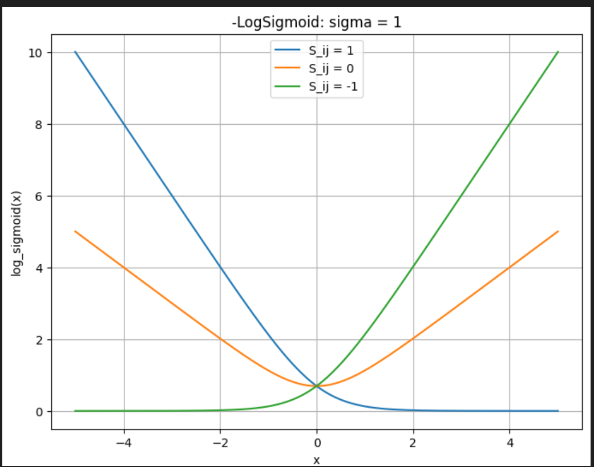
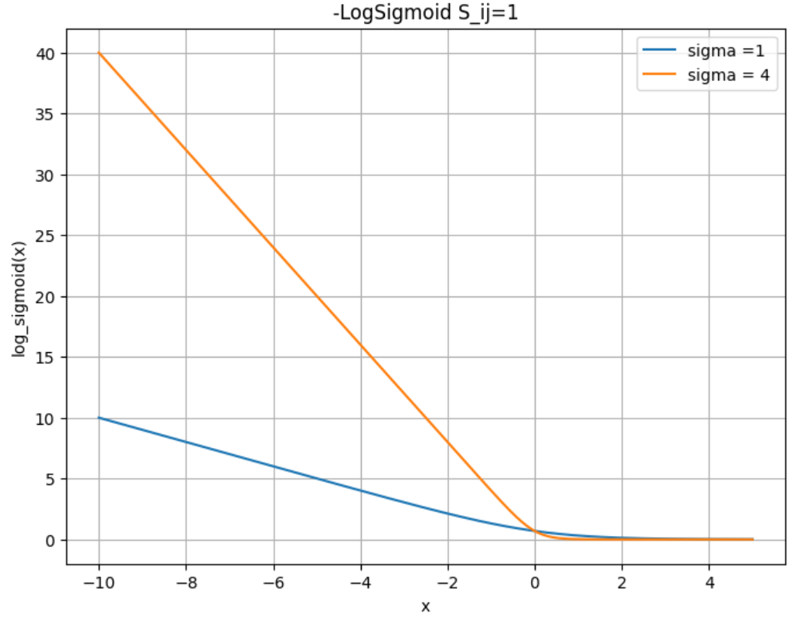

# 项目概述

​	本项目主要研究排序学习中常见的文本排序策略，比如margin ranking loss(又称margin triplet loss)，Adaptive margin ranking loss, RankNet, Adaptive RankNet.

$\text{Margin Ranking Loss}$


$\text{RankNet}$

​										$\begin{aligned}P(U_i \gt U_j)=\frac{1}{1+\exp (-\sigma(s_i-s_j))} \end{aligned}$

​	$\text{RankNet}$认为，对于文档$U_i$与$query$的相关性大于$U_j$相关性的概率为$\bar{P_{ij}}$，其中$\bar{P_{ij}}=\frac{1}{2}(1+S_{ij})$，其中：

​											$\begin{aligned}S_{ij}= \begin{cases}  1 &\text{if }U_i \gt U_j \\ 0 &\text{if } U_i=U_j \\ -1 &\text{if }U_i \lt U_j \end{cases}\end{aligned}$

​	对于任意文档对$(U_i,U_j)$关系的概率公式则可以用公式$P_{ij}^{\bar{P_{ij}}}(1-P_{ij})^{1-\bar{P_{ij}}}$进行描述。加上$-\log$符号，则有：

​					              			$\begin{aligned}L=-{\bar{P_{ij}}}\log(P_{ij})-{(1-\bar{P_{ij}})}\log(1-P_{ij}) \end{aligned}$

带入公式$(1.1)$​则有：

​									     $\begin{aligned}L&=-{\bar{P_{ij}}}\log(P_{ij})-{(1-\bar{P_{ij}})}\log(1-P_{ij}) \\ &=-\frac{1}{2}(1-S_{ij})\sigma(s_i-s_j)+\log(1+\exp(-\sigma(s_i-s_j))) \end{aligned}$

```latex
\begin{aligned}L&=-{\bar{P_{ij}}}\log(P_{ij})-{(1-\bar{P_{ij}})}\log(1-P_{ij}) \\ &=-\frac{1}{2}(1-S_{ij})\sigma(s_i-s_j)+\log(1+\exp(-\sigma(s_i-s_j))) \end{aligned}
```

​	 如果我们强制另$S_{ij}=1$，则有：

​										$\begin{aligned}L&=-\log(sigmoid(\sigma(s_i-s_j)))\end{aligned}$​

​	如下是一个简洁的实现，假设$query$和$doc_i$是相关的，和$doc_j$是没那么相关的。以文本检索的场景为例，$h_i=Encoder(query\oplus doc_i)\in \mathbb R^{1 \times 768},h_j=Encoder(query\oplus doc_j)\in \mathbb R^{1 \times 768}$：

```python
import torch.nn.functional as F
import torch.nn as nn

class PairWiseBertRanker(nn.Module):    
    def __init__(self,model_path,learnable_margin:bool=False) -> None:
        super().__init__()
        self.config = BertConfig.from_pretrained(model_path)
        self.model = BertModel.from_pretrained(model_path)        
        self.linear = nn.Linear(768,1)
        
    def forward(self,positive_inputs:Optional[Dict]=None,negative_inputs:Optional[Dict]=None):
        if positive_inputs is None:
            negative_outputs = self.model(**negative_inputs).last_hidden_state[:,0,:] #[Batch,768]
        	negative_logits = self.linear(negative_outputs)
            return neagtive_logits
        positive_outputs = self.model(**positive_inputs).last_hidden_state[:,0,:] #[Batch,768]
        positive_logits = self.linear(positive_outputs) #[Batch,1]
        negative_outputs = self.model(**negative_inputs).last_hidden_state[:,0,:] #[Batch,768]
        negative_logits = self.linear(negative_outputs) #[Batch,1]
        return positive_logits,negative_logits
    
class RankNetLoss(nn.Module):
    def __init__(self,sigma:torch.Tensor):
        super().__init__()
    	self.sigma = sigma
    def forward(self,positive_logits,negative_logits):
        loss = -1*F.logsigmoid(self.sigma*(positive_logits-negative_logits))
        return loss.mean()
```

$\text{RankNet}$损失函数如下（sigma=1）：



​	当$\sigma$等于其他值时，有：



​	即$\sigma$越大，惩罚越厉害。

$\text{Adaptive RankNet}$​​
